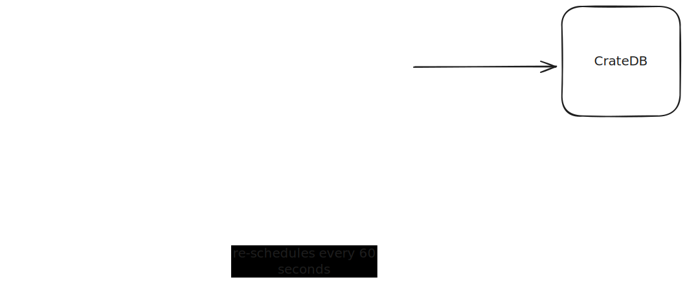

## Simple project to showcase how simple it is to aggregate data to CrateDB



The project uses the Crate's [sqlalchemy](https://cratedb.com/docs/python/en/latest/sqlalchemy.html) 
dialect and the python's [scheduler](https://docs.python.org/3/library/sched.html), it runs everything
synchronously.

Every 60s (time can be changed) it will make a https request to the weather api and insert it
into CrateDB.

### Setup
Get your api key in https://www.weatherapi.com/

### How to run in docker compose
Fill up the environment variables in the docker-compose.yml
```
docker compose up -d
```

